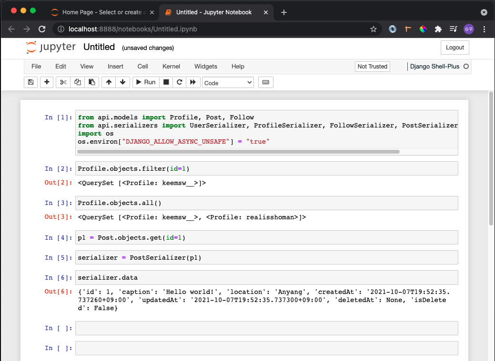
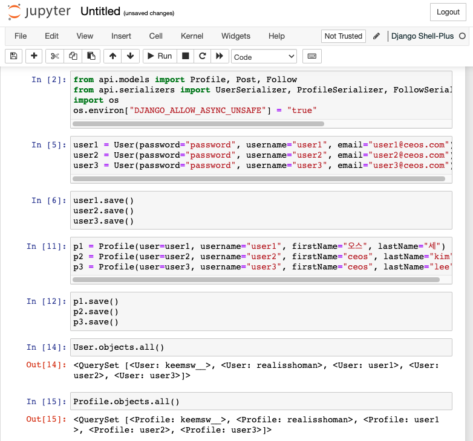
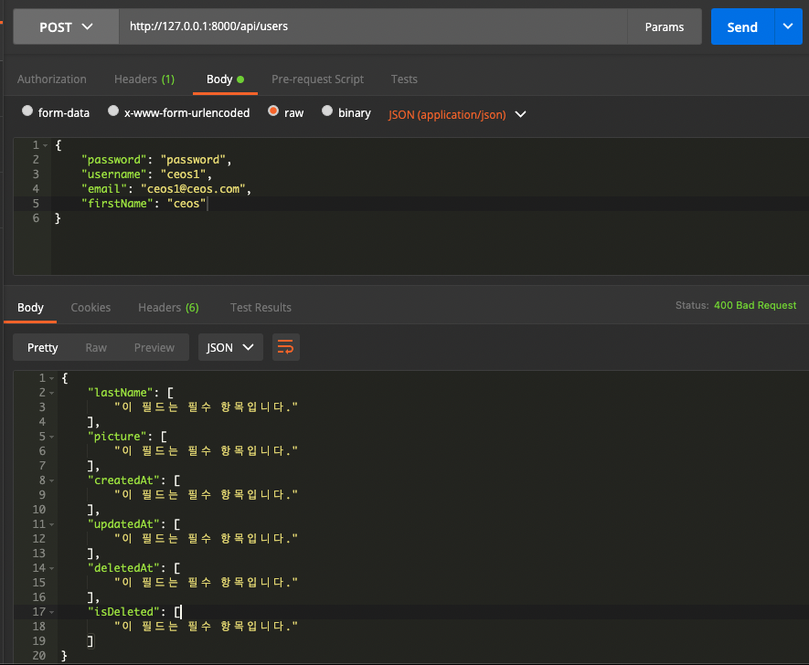
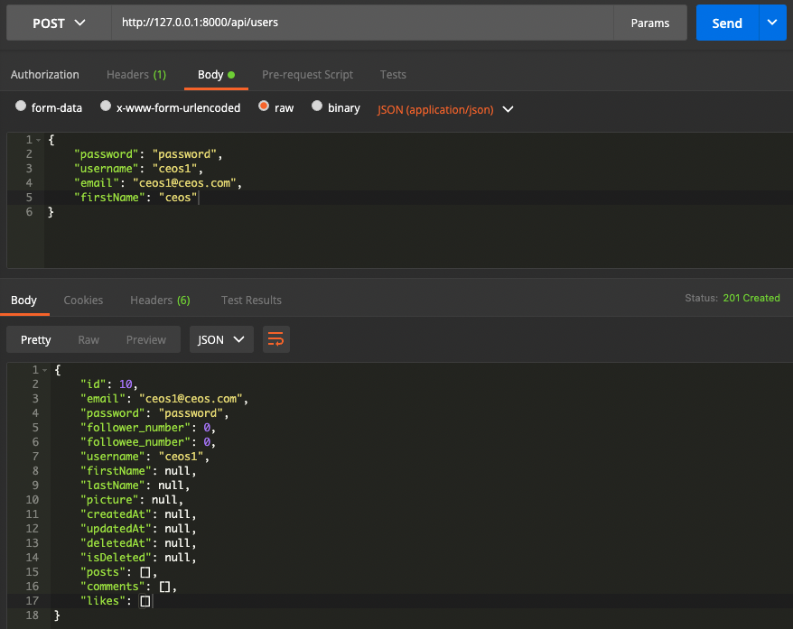
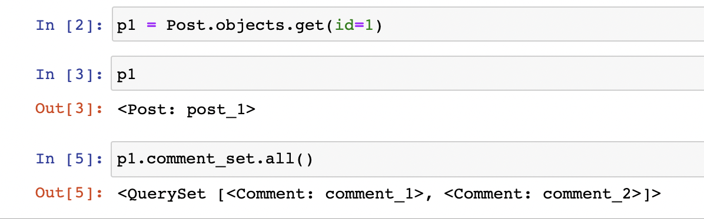
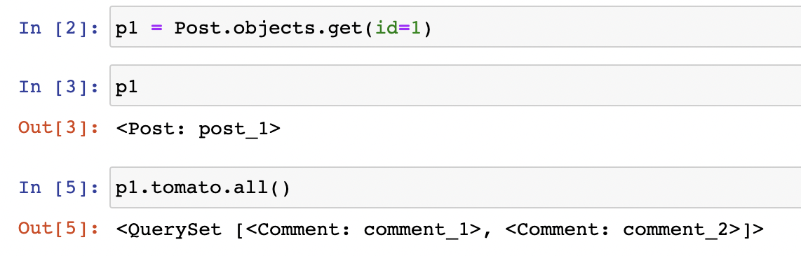

# 2주차 Study 내용 정리
# 1. NGINX란

- 웹 서버 소프트웨어다
- 가볍다
- 응용프로그램 서버로 요청을 보내는 리버스 프록시 역할
- HTML, CSS, JS, 이미지 같은 정적 파일 처리 HTTP 서버 역할
- 동시접속 처리에 특화되어 있다
- 비동기 처리 방식을 택한다

# 2. WSGI란

- 웹서버가 request를 Django같은 웹 프레임워크에 전달하는 호출 규약

Production 레벨에서는
WebServer(NGINX, APACHE) - Application Server(gunicorn, WSGI) - Django 같은 구조를 띈다

# 3. Docker

## What

도커는 컨테이너 기반의 오픈소스 가상화 플랫폼이다.

도커에는 다양한 개념들이 등장하는데, 가상화, VM, 컨테이너에 대해 아래 정리를 해 보았다.

## What +a (가상화, VM부터 컨테이너까지 정리)

### VM(Virtual Machine - 가상머신)

 가상 머신(Virtual Machine, VM)은 물리적 하드웨어 시스템(오프프레미스 또는 온프레미스에 위치)에 구축되어 자체 CPU, 메모리, 네트워크 인터페이스 및 스토리지를 갖추고 가상 컴퓨터 시스템으로 작동하는 가상 환경이다. 하이퍼바이저라 불리는 소프트웨어는 하드웨어에서 가상 머신의 리소스를 분리하고 적절히 프로비저닝하여 VM에서 사용할 수 있도록 한다. 소프트웨어 기반 컴퓨터라고 이해하면 된다.

(출처 : [https://www.redhat.com/ko/topics/virtualization/what-is-a-virtual-machine](https://www.redhat.com/ko/topics/virtualization/what-is-a-virtual-machine))

### Hypervisor 기반의 Virtualization

 가상화를 관리하는 소프트웨어(주로 Hypervisor)를 사용하여 하나의 물리적 머신에서 가상 머신(VM)을 만드는 프로세스.


(출처: [https://www.youtube.com/watch?v=bn-KfziRfiE](https://www.youtube.com/watch?v=bn-KfziRfiE))

 위에서 보는 것처럼 물리적 서버나 Host 위에서 Hypervisor라는 소프트웨어가 실행된다. Hypervisor는 두가지가 있다.

1. Type1
    - 물리적 서버의 리소스를 풀링하여 사용자의 가상환경에 바로 할당한다
    - 물리적 서버 상단에 바로 설치된다
    - 베어 메탈 하이퍼바이저(Bare Metal Hypervisor) 라고도 불린다
    - 가장 안전하고 대기시간이 짧으며 시중에 가장 많이 나와있다
    - VMware ESXi, Microsoft Hyper-V, 오픈소스 KVM 등
2. Type2
    - 물리적 서버와 하이퍼바이저 사이에 Host OS Layer가 있다
    - Oracle VirtualBox, VMware Workstation 등

 하이퍼바이저가 설치되었으면 그 위에 여러개의 VM을 구축할 수 있다. 하이퍼바이저는 이렇게 구축된 VM에 할당된 리소스를 관리한다. VM은 독립적이기 때문에 서로다른 운영체제를 실행할 수 있다. 또한 완전히 다른 머신의 하이퍼바이저 위로 VM을 이전할 수도 있다. 가상화 기술은 역사가 깊은 오래된 기술이지만, 클라우드 컴퓨팅 기술의 핵심이다.


### [가상화의 예시]

 가상화를 이용하면 서버를 통합(Server Consolidation) 하고 서버의 자원을 최대한으로 활용함으로써 서버 급증 문제(Server Proliferation Problem)를 해결할 수 있다.

 예를 들어, 용도가 다른 3개의 물리 서버가 있다고 가정하자. 1개는 메일서버이고, 다른 1개는 웹 서버이고, 다른 1개는 내무 레거시 애플리케이션을 실행하는 서버이다. 각 서버는 잠재적인 실행 용량의 30%만 사용되고 있지만, 내부 운영을 위해 레거시 애플리케이션이 계속 필요하므로, 레거시 애플리케이션과 이를 호스팅하는 또 다른 3번째 서버를 유지해야 한다.


 전통적으로 1개의 서버에 설치된 1개의 OS 위에 1개의 태스크를 수행하도록 하는 것이 더 쉽고 안정적인 경우가 많다. 하지만 이러한 경우 각각의 서버가 자원을 최대한으로 활용하지 않기 때문에 서버 전력비가 비효율적으로 발생하며, 각각의 서버가 서로 다른 공간에 위치하므로 공간 대여 비용도 발생하는 등 각각의 서버를 최대한으로 활용하지 못하고 있다.

 그러나 가상화를 사용하면 기존의 메일 서버를 2개로 분리하여 1개의 서버로는 메일을 처리하고, 1개의 서버로는 레거시 애플리케이션을 마이그레이션 할 수 있다.


 또한 메일서버를 만약 3개로 분리한다면, 메일 서버의 자원을 최대한으로 활용하고, 남은 2개의 서버는 다른 태스크를 처리하거나 사용을 중지하여 냉각 및 유지 관리 비용을 줄일 수 있다.

 출처

- [https://mangkyu.tistory.com/86](https://mangkyu.tistory.com/86)
- [https://www.redhat.com/ko/topics/virtualization/what-is-virtualization](https://www.redhat.com/ko/topics/virtualization/what-is-virtualization)
- [https://post.naver.com/viewer/postView.nhn?memberNo=2521903&volumeNo=21385900](https://post.naver.com/viewer/postView.nhn?memberNo=2521903&volumeNo=21385900)

### Container 기반의 Virtualization

 가상 머신(VM)은 하드웨어 스택을 가상화한다. 컨테이너(Container)는 이와 달리 운영체제 수준에서 가상화를 하여 여러개의 컨테이너들이 OS 커널에서 직접 구동한다. 컨테이너는 Hypervisor을 이용하는 VM 기반의 가상화보다 훨씬 가볍고 OS 커널을 공유하며, 시작이 훨씬 빠르고 OS 전체 부팅보다 메모리를 훨씬 적게 차지한다. OS 커널 단에서 프로세스를 격리하여 자원을 할당하게 되는데, 자세한 내용은 아래를 참조하면 된다.

 

> 컨테이너는 어느 날 갑자기 혜성처럼 등장한 가상화 기술은 아닙니다. 리눅스 기반 시스템에서 프로세스 간 격리를 위해 사용하던 기술들을 조합하여 발전시킨 것이라고 볼 수 있는데요. chroot와 네임 스페이스, cgroup을 조합한 형태인 LXC(Linux Container)에서부터 컨테이너 가상화 기술이 본격적으로 발전 했습니다.이 세 요소를 알고 있다면 OS 커널 단에서 프로세스를 어떻게 격리하여 자원을 할당하는지 파악할 수 있고, 컨테이너 가상화를 이해하기 수월합니다.  - chroot: 특정 디렉토리를 루트(최상위 디렉토리)로 인식하게끔 하는 명령어- 네임 스페이스: 리눅스 시스템 자원을 묶어 프로세스에 할당하는 방식으로, 하나의 프로세스 자원을 관리하는 기능- cgroup: CPU, 메모리 등 프로세스 그룹의 시스템 자원 사용량을 관리하여 특정 애플리케이션이 자원을 과다하게 사용하는 것을 제한먼저 chroot를 통해 특정 파일 디렉토리가 최상위 계정(Root)으로 인식되도록 한 후, cgroup과 네임스페이스를 통해 특정 프로세스에 자원을 할당하고 제어하는 방식입니다.
> 


> 이처럼 격리된 고유 영역에서 할당된 자원을 이용해 애플리케이션을 실행하는 것을 의미하는 컨테이너는 애플리케이션의 실행에 필요한 라이브러리와 바이너리, 기타 구성 파일을 ‘**이미지**’ 단위로 빌드하여 패키지로 배포합니다.실행에 필요한 모든 환경이 준비되어 있으므로 어떤 환경에서도 애플리케이션을 오류 없이 동작시킬 수 있는 것이 가장 큰 특징입니다.
> 

(참조: [https://post.naver.com/viewer/postView.nhn?memberNo=2521903&volumeNo=21385900](https://post.naver.com/viewer/postView.nhn?memberNo=2521903&volumeNo=21385900))

### VM vs Container


(참조: [https://post.naver.com/viewer/postView.nhn?memberNo=2521903&volumeNo=21385900](https://post.naver.com/viewer/postView.nhn?memberNo=2521903&volumeNo=21385900))

 일단 컨테이너는 VM과 비교해서 하이퍼바이저, 게스트 OS가 필요하지 않아 훨씬 가볍다. VM은 보통 수 GB에 해당하고, 실행과정은 'VM을 띄우고 → 자원 할당 하고 → 게스트 OS 부팅하고 → 어플리케이션 실행'으로 느리다. 컨테이너는 어플리케이션 실행패키지인 '이미지'만 있으면 되므로 훨씬 빠르고 가볍다.

다음은 표로 가상화 와 컨테이너를 비교해 보았다.

|종류|하이퍼 바이저 형 가상화|컨테이너 형 가상화|
|---|---|---|
|시작시간|몇 분|몇 초|
|이미지 크기|수 GB ~ 수백 GB|~ 수백 MB|
|Guest OS|Windows/Linux 등 다양한 선택 가능|호스트 OS 와 동일한 OS|
|이식성|대부분 가상 이미지에 대한 변환이 필요함|컨테이너 이미지 그대로 사용 가능|
|데이터 관리|VM 내부또는 연결된 스토리지에 저장|컨테이너 내부에 있는 데이터는 종료시 소멸되며, 필요에 따라 스토리지를 이용하여 저장|
|Guest OS 와의 관계|Guest OS는 하드웨어(가상)로 인식|Host OS를 커널 수준으로 분리하여 OS를 가상화 형태로 사용하여 필요에 따라 호스트와 리소스 공유 가능|


(참고: [http://www.opennaru.com/cloud/virtualization-vs-container/](http://www.opennaru.com/cloud/virtualization-vs-container/))

 결론 : 컨테이너를 관리하는 가상환경 플랫폼인 ‘도커(Docker)’를 이용하면, 컨테이너를 쉽게 생성하고 배포할 수 있다.

## Why

- 다양한 OS 환경에서 같은 개발-배포 환경을 만들어준다.
- 개발-배포 환경을 이미지 형태로 저장하고, 이를 바탕으로 컨테이너를 띄워 배포하므로 배포가 용이하고 매우 빠르다

## How

다음은 Dockerfile의 예시이다.

```docker
FROM python:3.8.3-alpine
ENV PYTHONUNBUFFERED 1

RUN mkdir /app
WORKDIR /app

# dependencies for psycopg2-binary
RUN apk add --no-cache mariadb-connector-c-dev
RUN apk update && apk add python3 python3-dev mariadb-dev build-base && pip3 install mysqlclient && apk del python3-dev mariadb-dev build-base

# By copying over requirements first, we make sure that Docker will cache
# our installed requirements rather than reinstall them on every build
COPY requirements.txt /app/requirements.txt
RUN pip install -r requirements.txt

# Now copy in our code, and run it
COPY . /app/
```

도커파일을 작성하는 문법은 상당히 직관적이고 간단하다. 필요한 패키지를 설치하고, 코드를 copy하는 등 서버 환경을 구축하기 위한 명령어들을 정의할 수 있다.

정의한 dockerfile은 docker build 명령어를 통해 이미지로 만들 수 있다. 아래는 로컬환경에서 확인한 도커 이미지들이다.


이후, 만들어진 이미지를 기반으로 docker run 명령어를 통해 컨테이너를 띄울 수 있다. 


# 4. docker-compose

## What

docker-compose란 docker 이미지 기반 다중 컨테이너를 정의하고 공유할 수 있는 툴이다.

## Why

도커 이미지를 빌드하고, 다양한 컨테이너로 띄우기 위한 과정을 줄일 수 있다. 이게 무슨 말인가 하면 docker로 이미지를 빌드하고, 그 이미지를 기반으로 container를 띄우기 위해서는 장황한 옵션과 함께 커맨드로 입력을 해줘야한다. 호스트 os와 컨테이너의 마운트 작업을 하고, 포트포워딩을 하고, 환경변수 값을 넘겨주고 등등... 매번 컨테이너를 띄울 때마다 상당히 번거로운 작업을 반복하게 된다. 컨테이너를 수시로 지웠다 다시 생성해야 하는 상황이라면, 이런 반복적인 작업이 반갑지는 않을 것이다. docker-compose는 이 작업들을 미리 정의해두기 때문에 문제점을 해결할 수 있다.

## How

Docker는 Dockerfile을 통해 이미지를 빌드하지만, docker-compose는 docker-compose.yml 파일을 통해 실행된다. 다음은 docker-compose.yml 파일의 예시이다.

```docker
version: '3'
services:

  db:
    container_name: db
    image: mariadb:latest
    restart: always
    environment:
      MYSQL_ROOT_HOST: '%'
      MYSQL_ROOT_PASSWORD: mysql
    expose:
      - 3306
    ports:
      - "3307:3306"
    env_file:
      - .env
    volumes:
      - dbdata:/var/lib/mysql

  web:
    container_name: web
    build: .
    command: sh -c "python manage.py migrate && python manage.py runserver 0.0.0.0:8000"
    environment:
      MYSQL_ROOT_PASSWORD: mysql
      DATABASE_NAME: mysql
      DATABASE_USER: 'root'
      DATABASE_PASSWORD: mysql
      DATABASE_PORT: 3306
      DATABASE_HOST: db
      DJANGO_SETTINGS_MODULE: django-rest-framework-14th.settings.dev
    restart: always
    ports:
      - "8000:8000"
    volumes:
      - .:/app
    depends_on:
      - db
volumes:
  app:
  dbdata:
```

docker-compose.yml 파일도 상당히 직관적이고 작성하기 쉽다. service 하단에 db, web 두가지가 정의되어 있다. db, web은 Dockerfile 이미지를 기반으로 생성될 container이다. db, web 서비스 하단에 정의되어 있는 것들을 간단히 확인해보자.

- environment : docker run 옵션 중 -e 에 해당된다.
- image : 사용할 도커 이미지를 정의한다.
- build : docker build 명령을 실행할 디렉토리 경로다.
- ports : docker run 옵션 중 -p에 해당되며, 포트포워딩을 설정할 수 있다.

이 외에도 다양한 docker build 옵션을 docker-compose.yml 파일을 통해 정의할 수 있다.

# 5. Github Action

## What

Github 저장소를 기반으로 Runners 라는 환경에서, 개발 Workflow를 자동화 할 수 있는 도구이다

## Why

개발을 하며 변경사항을 반영하여 빌드하고, 테스트하고, 배포하는 등 모든 과정을 개발자가 직접 하지 않고 손쉽게 자동화를 하기 때문에 사용된다.

아래 상황을 예시로 Github Action을 왜 쓰는지 알아보자.

> 웹 애플리케이션 개발을 완료하여 AWS EC2 우분투 서버에 배포하려고 한다. 처음 인스턴스를 생성하고 서버로 들어가보면 정말 아무것도 없다. 배포를 위해 필요한 패키지들을 설치하고, 배포환경을 구축 한다. 드디어 git pull 또는, docker로 배포할 경우 docker pull 로 소스코드 혹은 이미지를 받아와 배포를 진행한다. 처음부터 상당히 손이 많이 가는데, 이후에 여러명과 개발을 진행하며 기능이 추가되었다. master 브랜치에 반영된 새로운 기능들을 배포판에도 업데이트를 해줘야하는데, 당장은 서버로 들어가 새로운 코드로 갱신해주는 방법 밖에 없다.
> 

단순 반복작업 때문에 생산성이 떨어지는 경험을 할 수 있다. 여러 사람과 함께 개발을 하며 갱신된 master 브랜치의 내용으로 자동 배포되면 얼마나 좋을까? 바로 이것을 Github action이 해결해준다.

## How

전체적인 프로세스는 다음과 같다

1. 프로젝트 레파지토리에 .github/workflows/deploy.yml 을 생성한다
2. deploy.yml 에는 git push 나 pull request 같은 이벤트 발생시 어떤 일을 할 지 정의한다
3. 실제로 트리거 이벤트(push, pr)을 발생시켰을 때, github action 탭에서 액션을 확인할 수 있다.

deploy.yml은 다음과 같은 구조를 가진다.

```yaml
name: ~~~
on: [push]
jobs:

  build:
    name: ~~~
    runs-on: ubuntu-latest
    steps:
    - name: checkout
      uses: actions/checkout@master

		- name: create env file
      run: |
        touch .env
        echo "${{ secrets.ENV_VARS }}" >> .env
```

- 어떤 이벤트에 반응하여 액션을 수행할지 적어준다 → on: [push] (push에 대해 반응)
- 최소 한 개 이상의 job을 정의하며, 안에는 여러개의 step으로 구성된다
- 각 step 안에서 커맨드를 실행하거나, Github 마켓플레이스에 공유된 Action을 가져와 수행한다.
- "checkout"에 해당하는 step은 "actions/checkout@master"라는 action을 가져와 수행한다.
- "create env file"에 해당하는 step은 run에 정의된 커맨드들을 수행한다.


이 때, secrets.ENV_VARS는 Github Secret 탭에서 미리 정의한 변수이다. 보안상의 이유로 소스코드 형태 그대로 올릴 수 없기 때문에 이와 같이 처리했다.

아래는 스터디에 사용된 deploy.yml 코드이다

```yaml
name: Deploy to EC2
on: [push]
jobs:

  build:
    name: Build
    runs-on: ubuntu-latest
    steps:
    - name: checkout
      uses: actions/checkout@master

    - name: create env file
      run: |
        touch .env
        echo "${{ secrets.ENV_VARS }}" >> .env

    - name: create remote directory
      uses: appleboy/ssh-action@master
      with:
        host: ${{ secrets.HOST }}
        username: ubuntu
        key: ${{ secrets.KEY }}
        script: mkdir -p /home/ubuntu/srv/ubuntu

    - name: copy source via ssh key
      uses: burnett01/rsync-deployments@4.1
      with:
        switches: -avzr --delete
        remote_path: /home/ubuntu/srv/ubuntu/
        remote_host: ${{ secrets.HOST }}
        remote_user: ubuntu
        remote_key: ${{ secrets.KEY }}

    - name: executing remote ssh commands using password
      uses: appleboy/ssh-action@master
      with:
        host: ${{ secrets.HOST }}
        username: ubuntu
        key: ${{ secrets.KEY }}
        script: |
          sh /home/ubuntu/srv/ubuntu/config/scripts/deploy.sh
```

step 별로 어떤 액션을 하는지 알아보자

1. checkout : 깃헙 코드를 GitHub runners 인스턴스에 올린다
2. create env file : secrets 탭에 정의한 ENV_VARS으로 .env 파일을 생성한다
3. create remote directory : ec2 서버 /home/ubuntu/srv/ubuntu 디렉토리를 구축한다
4. copy source via ssh key : rsync로 runners 내부의 파일(깃헙 코드 + .env)를 ec2 인스턴스로 동기화한다
5. executing remote ssh commands using password : deploy.sh를 실행한다
(deploy.sh는 ec2서버에 docker, docker-compose를 설치하기 위한 스크립트다)

# 3주차 Study 내용 정리
# ER 다이어그램

## 식별 vs 비식별 관계

우선 다음과 같은 상품 : 주문 관계를 보면, 상품 : 주문 관계는 다대다 관계다.

따라서 가운데 주문_상품 참조 테이블을 둬 1:N, N:1 관계로 만들어줬다.


### 식별?


부모 테이블(상품, 주문)의 기본키(PK)를 자식 테이블(주문_상품)의 외래키(FK)이자 기본키(PK)로 갖는 구조!

- FK를 PK로 갖기 때문에, 주문_상품 테이블에 행을 추가할 때 상품번호, 주문번호중 어느 하나라도 없으면 데이터를 생성할 수 없음
- 실선이다

ex: 게시글 : 작성된 댓글 → 식별관계이다. 게시글이 없으면 댓글이 없으니까!

### 비식별?


부모 테이블(상품, 주문)의 기본키(PK)를 자식 테이블(주문_상품)의 외래키(FK)로만 가지고, PK는 다른 값을 갖는 구조! (PK는 주문_상품번호 라는 새로운 필드)

- 식별관계와 다르게 주문번호, 상품번호중 어느 하나가 없더라도 자식테이블에 행을 추가할 수 있다!
- 점선이다

ex : 회사 부서 : 사원 → 비식별관계이다. 신입사원이 아직 부서에 배정되지 않았을 수도 있기 때문!

### 정리


### Ref

[https://velog.io/@jch9537/DATABASE-식별과-비식별-관계](https://velog.io/@jch9537/DATABASE-%EC%8B%9D%EB%B3%84%EA%B3%BC-%EB%B9%84%EC%8B%9D%EB%B3%84-%EA%B4%80%EA%B3%84)

[https://gngsn.tistory.com/48](https://gngsn.tistory.com/48)

## ER 다이어그램 작성법 - 관계 표현 방법

 

사원 : 부서 = N : 1 = one or more : one and only one

 

실선 : Must be → 사원 입장에서 반드시 부서에 속해야됨 (좌 → 우로 읽음)

점선 : May be → 부서 입장에서 사원을 배치 받을수도, 아닐수도 있음 (우→좌로 읽음)

### 1:1

 

양방향이 모두 실선인 경우는 매우 드물다

라면은 두개 이상의 스프를 포함하고 있지 않고, 스프도 한개 이상의 라면에 들어있지 않다.

### M:1


가장 보편적인 관계

### M:M


자주 발생하는 형태지만, 최종 결과는 M:M 으로 표현되지 않는다.

M:1 관계로 분할해서 표현한다

### O 표시


까마귀 발에 O가 있으면 one or many가 아니라 zero or many의 의미다.

0 이상이라는 뜻!

### Ref

[https://dlgkstjq623.tistory.com/319](https://dlgkstjq623.tistory.com/319)

# 인스타그램 DB 모델링
## 인스타그램 서비스 설명
인스타그램이 무슨 서비스인지는 대부분이 실제 사용을 해왔기 때문에 자세한 설명을 생략하겠다. 
대신 우리가 무심코 썼던 인스타그램에는 어떤 기능들이 있는지 하나하나 정리해보자!

### 이번에 고려한 기능들
- [x] 유저 생성
- [x] 로그인
- [x] 로그아웃
- [x] 게시글 좋아요
- [x] 게시글 댓글 작성
- [x] 팔로우
- [x] 언팔로우
- [x] 프로필 수정
- [x] 게시글 작성 (사진/영상 업로드)
- [x] 게시글 수정 (사진/영상 수정 혹은 삭제)
- [x] 유저 정보 조회

### 추후에 고려할 기능들
- [ ] 해시태그 생성
- [ ] 해시태그 검색
- [ ] 유저 검색
- [ ] 피드(게시글) 조회
- [ ] DM 보내기
- [ ] 스토리 생성
- [ ] 댓글 좋아요

## 인스타그램 ER 다이어그램
위에서 정리해본 기능들을 바탕으로 필요한 테이블들을 작성했다! 사용한 툴은 [erdcloud](https://www.erdcloud.com/d/WmGcHJb9WT3hhGxf3) 이다.

테이블들을 하나하나 설명하기에 앞서 관계식을 살펴보자. <br/><br/>
**User(장고 기본제공)과 Profile**은 1:1 비식별 관계이다. User 테이블로부터 OneToOneField로 확장한 형태다. 우선 인스타그램에 실제 가입해보면,
사용자 세부정보를 추후에 입력할 수 있다. 따라서 비식별 관계로 지정을 해줬다.<br/><br/>
**User-Follow**는 1:N 관계이다. Follow는 사실 User와 User간의 N:M 팔로우 기능을 구현하고 싶어 만든 테이블이다. 한 User에 대해 여러 Follow 관계
를 포함할 수 있기 때문에 1:N 비식별 관계로 지정했다.<br/><br/>
**User-Post-Comment-Like** 관계를 살펴보자. Post에 대해 여러 Like, Comment가 달릴 수 있다. 또한, User는 여러 Post를 생성할 수 있다.
뿐만 아니라, Comment와 Like도 User가 여럿 생성할 수 있다.
- User : Post = 1 : N
- User : Comment = 1 : N
- User : Like = 1 : N
- Post : Comment = 1 : N
- Post : Like = 1 : N

정리하면 이렇게 얽히고 설킨 복잡한 관계로 표현 가능하다.<br/><br/>
마지막으로 **Post-File**은 1:N 비식별 관계이다. Post에 텍스트형태의 게시글(caption) 이외에도 하나 이상의 사진, 영상을 올리기 때문에 다음과 같이
관계를 설정했다.

## 인스타그램 Django 모델
### User
장고에서 기본으로 제공하는 auth_user model이다. 로그인에 필요한 정보만 담기 위해 email, password 필드만 명시했다.

### Profile
User의 상세 정보가 담긴 테이블이다. 인스타그램 상에서 프로필에 대한 모든 정보가 담겨있다.
```python
class Profile(models.Model):
    user = models.OneToOneField(User, on_delete=models.CASCADE)
    username = models.CharField(max_length=50)
    firstName = models.CharField(max_length=50)
    lastName = models.CharField(max_length=50)
    picture = models.CharField(max_length=200)
    createdAt = models.DateTimeField('createdAt')
    updatedAt = models.DateTimeField('updatedAt')

    def __str__(self):
        return self.username
```
- user : OneToOneField를 통해 User 테이블을 확장하여 만들었다. 1-1 관계를 표현하는 필드.
- username : 인스타그램 유저명(인스타 닉네임)
- firstName : 이름
- lastName : 성
- picture : 프로필 사진에 대한 url 주소
- createdAt : 생성 시각
- updatedAt : 수정 시각

### Post
인스타그램 게시글에 대한 테이블이다.
```python
class Post(models.Model):
    user = models.ForeignKey(User, on_delete=models.CASCADE)
    caption = models.CharField(max_length=300)
    location = models.CharField(max_length=100)
    createdAt = models.DateTimeField('createdAt')
    updatedAt = models.DateTimeField('updatedAt')

    def __str__(self):
        return 'post_' + str(self.id)
```
- user : User-Post는 1:N 관계이다. user_id를 외래키로 가지며 참조한다
- caption : 게시물의 글 내용
- location : 위치정보를 텍스트 형태로 저장한다
- createdAt : 생성 시각
- updatedAt : 수정 시각

### File
게시물에 업로드할 사진과 영상에 대한 정보가 담긴 테이블이다.
```python
class File(models.Model):
    post = models.ForeignKey(Post, on_delete=models.CASCADE)
    url = models.CharField(max_length=300)
    createdAt = models.DateTimeField('createdAt')
    updatedAt = models.DateTimeField('updatedAt')

    def __str__(self):
        return 'file_' + str(self.id)
```
- post : Post-File은 1:N 관계이다. post_id를 외래키로 가지며 참조한다
- url : 이미지 또는 영상에 대한 url 주소를 저장한다
- createdAt : 생성 시각
- updatedAt : 수정 시각

### Comment
게시물에 달리는 댓글에 대한 테이블이다.
```python
class Comment(models.Model):
    post = models.ForeignKey(Post, on_delete=models.CASCADE)
    user = models.ForeignKey(User, on_delete=models.CASCADE)
    text = models.CharField(max_length=300)
    createdAt = models.DateTimeField('createdAt')
    updatedAt = models.DateTimeField('updatedAt')

    def __str__(self):
        return 'comment_' + str(self.id)
```
- post : Post-Comment는 1:N 관계이다. 어떤 게시물에 달린 댓글인지 식별하기 위해 Post를 참조한다
- user : User-Comment도 1:N 관계이다. 누가 생성한 댓글인지 식별하기 위해 User를 참조한다
- text : 댓글 내용을 텍스트 형태로 저장한다
- createdAt : 생성 시각
- updatedAt : 수정 시각

### Like
게시글에 달리는 좋아요에 대한 테이블이다.
```python
class Like(models.Model):
    post = models.ForeignKey(Post, on_delete=models.CASCADE)
    user = models.ForeignKey(User, on_delete=models.CASCADE)
    createdAt = models.DateTimeField('createdAt')
    updatedAt = models.DateTimeField('updatedAt')

    def __str__(self):
        return 'like_' + str(self.id)
```
- post : Post-Like는 1:N 관계이다. 어떤 게시물에 달린 좋아요인지 식별하기 위해 Post를 참조한다
- user : User-Like도 1:N 관계이다. 누가 누른 좋아요인지 식별하기 위해 User를 참조한다
- createdAt : 생성 시각
- updatedAt : 수정 시각

### Follow
인스타그램 기능의 꽃인 팔로우/팔로잉 기능을 구현한 테이블이다. 구조를 짜는 과정에서 고민이 많았다. User-User가 N:M 관계를 따르는 구조이기 때문에 Follow라는
중간 참조 형태의 테이블을 정의했다. (잘못된 부분이 있으면 피드백 부탁드려요!)
```python
class Follow(models.Model):
    follower_user_id = models.ForeignKey(User, related_name='follower_user_id', on_delete=models.CASCADE)
    followee_user_id = models.ForeignKey(User, related_name='followee_user_id', on_delete=models.CASCADE)
    createdAt = models.DateTimeField('createdAt')
    updatedAt = models.DateTimeField('updatedAt')

    def __str__(self):
        return 'follow_' + str(self.id)
```
- follower_user_id : 누가(어떤 User) 팔로우를 할 지에 대해 User를 외래키로 갖는다
- followee_user_id : 누구를(어떤 User) 팔로우 할 지에 대해 User를 외래키로 갖는다
- createdAt : 생성 시각
- updatedAt : 수정 시각

## DB에 데이터 담아보기
위에 작성한 model들을 mysql db에 동기화 하기 위해 python migrate를 진행하자.
Database명은 seungstagram으로 정했다.


### User and Profile 생성
내 프로필을 생성해보았다.
```python
# import
>>> from api.models import Profile, Post, File, Comment, Like, Follow
>>> from django.contrib.auth.models import User

# user 생성
>>> kim_user = User(password="password")
>>> kim_user.save()

# profile 생성
>>> kim_profile = Profile.objects.create(user=kim_user, username='keemsw__', firstName='Seungwoo', lastName='Kim', createdAt=timezone.now(), updatedAt=timezone.now())
>>> kim_profile
<Profile: keemsw__>
>>> kim_user.profile
<Profile: keemsw__>
```

두번째 가입자는 빈지노다.
```python
# user 생성
>>> beenzino = User(password="password")
>>> beenzino.username = 'realisshoman'
>>> beenzino.save()

# profile 생성
>>> beenzino_profile = Profile.objects.create(user=beenzino, firstName='성빈', lastName='임', createdAt=timezone.now(), updatedAt=timezone.now())
>>> beenzino.profile.firstName
'성빈'
>>> beenzino_profile.save()
```

### 팔로우 하기
내가 지노형을 팔로우하기 시작했다.
```python
>>> follow = Follow(follower_user_id=kim_user, followee_user_id=beenzino, createdAt=timezone.now(), updatedAt=timezone.now())

```
그랬더니 지노형도 나를 팔로우 해줬다ㅎㅎ
```python
>>> follow2 = Follow(follower_user_id=beenzino, followee_user_id=kim_user, createdAt=timezone.now(), updatedAt=timezone.now())
>>> follow2.save()
```


### 게시물 올리기
내가 계정을 생성하고 첫 게시물을 올렸다.

```python
>>> post1 = Post(user=kim_user, caption='Hello world!', location='Anyang', createdAt=timezone.now(), updatedAt=timezone.now())
>>> post1.save()
>>> kim_user.post_set.all()
<QuerySet [<Post: post_1>]>
```


## 게시물에 댓글 작성하기
지노형이 내 게시물을 보고 댓글을 달아줬다ㅎㅎ.
이번에는 beenzino 인스턴스로부터 시작해 댓글을 작성했다! (beenzino.comment_set.create() 방식 사용)
```python
>>> beenzino.comment_set.create(post=post1, user=kim_user, text='hi', createdAt=timezone.now(), updatedAt=timezone.now())
<Comment: comment_1>
>>> beenzino.comment_set.all()
<QuerySet [<Comment: comment_1>]>
>>> beenzino.comment_set.filter(post=post1)
<QuerySet [<Comment: comment_1>]>
```


## Like
댓글에 이어 좋아요까지 달아주셨다ㅠㅠ

```python
>>> beenzino.like_set.create(post=post1, user=kim_user, createdAt=timezone.now(), updatedAt=timezone.now())
<Like: like_1>
```


## 기타 후기
이번 과제를 하면서 예상치 못한 에러를 마주해 살짝은 고통스러울 뻔 했다,,,ㅠ 하지만 구글링으로도 해결 못한 것들을 슬랙에 올렸더니 많은 분들이
적극적으로 도와주셔서 금방 해결할 수 있었다. 나도 성장해서 남의 에러를 해결해주고싶다. 에러 내용은 Pycharm 터미널에서 python migrate가 제대로
되지 않는 에러였는데, 일부 해결을 한 상태이며 자세한 내용은 슬랙에 올려두었다.

### 마주한 이슈


처음에 Follow 테이블 필드에 두개의 User 외래키를 설정했는데 저런 에러가 나타났다. 구글링을 해보니 related_name이라는 column을 추가하여
구분을 하라는 글을 봤다. related_name으로 구분을 해주니 문제가 해결됐다.

## 피드백 반영 및 추가 사항
### 모델 필드
```python
# 수정 이전 코드
createdAt = models.DateTimeField('createdAt')
updatedAt = models.DateTimeField('updatedAt')

# 수정 이후 코드
createdAt = models.DateTimeField(auto_now_add=True)
updatedAt = models.DateTimeField(auto_now=True)
```
auto_now_add=True 옵션은 레코드 **생성**시 현재 시간을 자동 저장한다.
auto_now=True 옵션은 레코드 **갱신**시 현재 시간을 자동 저장한다.

```python
# 모델 필드 중 일부
caption = models.CharField(max_length=300)
location = models.TextField()
```
Charfield는 길이 제한이 있지만, TextField는 제한이 없다.

# 4주차 Study 내용 정리
# Jupyter Notebook

장고를 쓴지 얼마 안됐지만 `python manage.py shell` 을 이용해서 작업하다보면 불편함이 많았다... 
입력 이력도 남기기 힘들고, Line by Line으로 코드를 입력해야 해서 생산성이 떨어지는 것 같았다. 좀 더 편하게 작업할 수 없을까ㅠ

이전에 파이썬으로 개발을 하거나 리눅스 서버 관리하고 머신러닝 공부를 할 때 GUI 형태로 편하게 개발하고 관리를 했던 
Jupyter Notebook가 떠올랐다. Python shell과 비슷한데 웹브라우저 상에서 블록 단위로 코드를 실행할 수 있고,
입력 커맨드와 출력 로그를 파일 형태로 저장할 수 있어 **매우매우매우** 편리하다.

다행히 장고 프로젝트에 대해 jupyter notebook으로 django shell을 사용할 수 있었다.

```bash
# 꽤 많은 패키지가 깔리니 겁먹지 말자
# 근데 Github Action에서 또 빨간불이 떠서 천천히 살펴봐야할 것 같다ㅠ
pip install django-extensions
pip install "ipython[notebook]"
```

이후에 settings.py(우리 프로젝트에선 settings/base.py) 의 INSTALLED_APPS에 `django_extension` 을 추가해주면 된다.

```python
# settings/base.py
INSTALLED_APPS = [
...
'django_extensions',
]
```

다음은 shell_plus —notebook 명령어로 jupyter notebook을 실행할 수 있다.

```bash
python manage.py shell_plus --notebook
```

manage.py가 있는 디렉토리를 기준으로 jupyter notebook이 실행되었다. 우측 상단에 new를 통해 Django Shell-plus를 누르면 새로운 .ipynb 형태의 파일을 생성할 수 있다.


python shell에서 하던 작업을 똑같이 하면 된다. 코드블럭 좌측에 번호가 있는데, 몇번째로 실행됐는지를 나타내는 번호다. 첫번째 코드블럭 좌측에 1번이라 있기 때문에 처음으로 저 코드 블럭이 실행됐다는 뜻이다. 



참고로 그냥 ORM을 사용하면 비동기 관련 이슈가 있어 다음과 같은 코드를 추가해 실행했다

```python
os.environ["DJANGO_ALLOW_ASYNC_UNSAFE"] = "true"
```

## Ref

[https://wayhome25.github.io/django/2017/03/21/django-ep7-django-shell/](https://wayhome25.github.io/django/2017/03/21/django-ep7-django-shell/)

# 4주차 과제 수행 내용
우선 views.py를 다음과 같이 정의하였다. 4주차 스터디 자료와 동일하게 GET, POST 메소드를 정의했으며, 우선은 user와 post에 대한 일부 메소드만
정의한 형태이다.
```python
# api/views.py
from django.shortcuts import render
from django.http import JsonResponse
from django.views.decorators.csrf import csrf_exempt
from rest_framework.parsers import JSONParser
from django.contrib.auth.models import User
from .models import Profile, Post, Follow, File, Comment, Like
from .serializers import UserSerializer, ProfileSerializer, PostSerializer, FollowSerializer, FileSerializer, CommentSerializer, LikeSerializer

@csrf_exempt
def user_list(request):
    if request.method == 'GET':
        users = User.objects.all()
        serializer = UserSerializer(users, many=True)
        return JsonResponse(serializer.data, safe=False)

    elif request.method == 'POST':
        data = JSONParser().parse(request)
        serializer = UserSerializer(data=data)
        if serializer.is_valid():
            serializer.save()
            return JsonResponse(serializer.data, status=201)
        return JsonResponse(serializer.errors, status=400)


def post_list(request):
    if request.method == 'GET':
        posts = Post.objects.all()
        serializer = PostSerializer(posts, many=True)
        return JsonResponse(serializer.data, safe=False)

    elif request.method == 'POST':
        data = JSONParser().parse(request)
        serializer = PostSerializer(data=data)
        if serializer.is_valid():
            serializer.save()
            return JsonResponse(serializer.data, status=201)
        return JsonResponse(serializer.errors, status=400)
```
## 한가지 궁금한 점
지금은 views.py에 모든 모델에 대응되는 메소드를 정의했다. 하지만 **코드의 가독성을 높이기 위해** 이를 모델별로 파일을 분리하여 메소드 정의에 최적화를 
할 수 있지 않을까? 또한, 지금은 `if requeste.method == 'GET'` 하단에 비즈니스 로직(어떤 작업을 할 지)가 정의되어 있는 형태이다.
이 비즈니스 로직을 다른 디렉토리에서 여러개의 파일 형태로 관리하고, views.py의 `if requeste.method == 'GET'` 하단에 호출하는 형태로
분리할 수 있진 않을까? API route와 비즈니스 로직을 분리하는 시도가 될 수 있을 것 같다. 이후 스터디를 통해 view를 깊게 공부할 기회가 있을 것
같으니 그 때 배우고 해결되지 않으면 더 알아보도록 해야겠다.

다음으로 url은 다음과 같이 매칭시켜주었다.
```python
# api/urls.py (하위 url)
from django.urls import path
from .views import user_list, post_list

urlpatterns = [
    path('users',user_list),
    path('posts', post_list),
]
```
```python
# django-rest-framework-14th/urls.py (상위 url)
from django.contrib import admin
from django.urls import path, include

urlpatterns = [
    path('admin/', admin.site.urls),
    path('api/', include('api.urls')),
]
```


# 데이터 삽입
Jupyter notebook을 이용해 실제 데이터를 넣었다. 이 때 사용된 모델은 User, Profile 모델이다.

참고로 저번 피드백 이후 createdAt, updatedAt과 같은 중복되는 부분들에 대해 BaseModel을 선언하여
상속받는 형태로 수정해보았다.
```python
# Base model
class BaseModel(models.Model):
    # 삭제는 Boolean으로 관리하고 실제 DB에서는 지우지 않았다
    isDeleted = models.BooleanField(default=False)
    deletedAt = models.DateTimeField(null=True)
    createdAt = models.DateTimeField(auto_now_add=True)
    updatedAt = models.DateTimeField(auto_now=True)

    class Meta:
        # abstract로 정의해 다른 모델이 상속 받을 수 있다
        # abstract = False라면 migrate시 DB에 테이블이 생성된다
        abstract = True

    def delete(self, using=None, keep_parents=False):
        self.is_deleted = True
        self.deletedAt = datetime.now()
        self.save()

class Profile(BaseModel):
    user = models.OneToOneField(User, on_delete=models.CASCADE)
    username = models.CharField(max_length=50)
    firstName = models.CharField(max_length=50)
    lastName = models.CharField(max_length=50)
    picture = models.CharField(max_length=200)

    class Meta:
        db_table = 'profile'

    def __str__(self):
        return self.username
```
실제로 데이터를 넣고 14, 15번째 코드블럭 로그에서 삽입이 된 것을 확인할 수 있다.


# 모든 데이터를 가져오는 API

일차적으로 User serializer를 다음과 같이 선언했다. 하지만 미흡한 부분이 많다는것을 테스트 몇번을 해보고 알
게되었다ㅠㅠ

```python
class UserSerializer(serializers.ModelSerializer):
    # OneToOne Relationship Searialzer (Profile)
    # Profile에 1:1로 이어진 필드에 접근하기 위해 이렇게 선언했다!
    firstName = serializers.CharField(source='profile.firstName')
    lastName = serializers.CharField(source='profile.lastName')
    picture = serializers.CharField(source='profile.picture')
    createdAt = serializers.CharField(source='profile.createdAt')
    updatedAt = serializers.CharField(source='profile.updatedAt')
    deletedAt = serializers.CharField(source='profile.deletedAt')
    isDeleted = serializers.CharField(source='profile.isDeleted')

    # Nested Serailzer
    # 1:N으로 User를 참조하는 모델들에 대한 정보를 가져오기 위해 이렇게 선언했다!
    posts = PostSerializer(source='post_set', many=True, read_only=True)
    comments = CommentSerializer(source='comment_set', many=True, read_only=True)
    likes = LikeSerializer(source='like_set', many=True, read_only=True)
    follows = FollowSerializer(many=True, read_only=True)

    class Meta:
        model = User
        fields = ['id',
                  'email',
                  'password',
                  'username',
                  'firstName',
                  'lastName',
                  'picture',
                  'createdAt',
                  'updatedAt',
                  'deletedAt',
                  'isDeleted',
                  'posts',
                  'comments',
                  'likes',
                  'follows',
                  ]
```

 다음은 위에 `GET api/users` 호출시 response이다. 모든 user의 list를 반환해준다. 나는 테스트를 위해
Postman에서 작업을 했다. (drf가 웹 형태로 안열려서 일단은 포기했다...ㅠㅠ 나중에 해결해보는 걸루,,)

```json
// GET api/users Response
[
    {
        "id": 1,
        "email": "",
        "password": "password",
        "username": "keemsw__",
        "firstName": "Seungwoo",
        "lastName": "Kim",
        "picture": "",
        "createdAt": "2021-10-07 10:30:06.757611+00:00",
        "updatedAt": "2021-10-07 10:30:06.757688+00:00",
        "deletedAt": null,
        "isDeleted": "False",
        "posts": [
            {
                "id": 1,
                "caption": "Hello world!",
                "comments": [
                    {
                        "id": 1,
                        "text": "hi",
                        "createdAt": "2021-10-07T19:58:00.260379+09:00",
                        "updatedAt": "2021-10-07T19:58:00.260531+09:00",
                        "deletedAt": null,
                        "isDeleted": false
                    },
                    {
                        "id": 2,
                        "text": "hello",
                        "createdAt": "2021-10-14T01:42:44.556667+09:00",
                        "updatedAt": "2021-10-14T01:42:44.556701+09:00",
                        "deletedAt": null,
                        "isDeleted": false
                    }
                ],
                "files": [],
                "likes": [
                    {
                        "id": 1,
                        "createdAt": "2021-10-07T21:58:10.494431+09:00",
                        "updatedAt": "2021-10-07T21:58:10.494507+09:00",
                        "deletedAt": null,
                        "isDeleted": false
                    }
                ],
                "createdAt": "2021-10-07T19:52:35.737260+09:00",
                "updatedAt": "2021-10-07T19:52:35.737300+09:00",
                "deletedAt": null,
                "isDeleted": false
            },
            {
                "id": 2,
                "caption": "2nd post",
                "comments": [],
                "files": [],
                "likes": [],
                "createdAt": "2021-10-14T01:29:29.262631+09:00",
                "updatedAt": "2021-10-14T01:29:29.262745+09:00",
                "deletedAt": null,
                "isDeleted": false
            }
        ],
        "comments": [],
        "likes": []
    },
   ...
]
```

가만히 들여다보니 User를 참조하는 자식 모델들(Profile, Follow, Post, Comment, Like)이 상당히 
많은데, Nested Serailzer를 위해 그대로 필드에 자식 모델들에 대한 Serializer를 필드값으로 선언하니
불필요한 데이터까지 너무 많이 담겼다. 추후에 Serializer Method Field를 UserSerializer에 추가해서
꼼꼼하게 리팩토링 해야겠다.

어느정도 리팩토링에 대한 필요성을 느껴서 바로 몇가지를 추가했다. PostSerializer에 대해 좋아요 수와 댓글 수를 알려줄 수 있도록 Serializer Method Field를 추가로 정의했다.

```python
class PostSerializer(serializers.ModelSerializer):
    files = FileSerializer(source='file_set', many=True, read_only=True)
    comments = CommentSerializer(source='comment_set', many=True, read_only=True)
    likes = LikeSerializer(source='like_set', many=True, read_only=True)

    # Serializer Method Field
    like_count = serializers.SerializerMethodField()
    comment_count = serializers.SerializerMethodField()
    class Meta:
        model = Post
        fields = [
            'id',
            'caption',
            'like_count',
            'comment_count',
            'comments',
            'files',
            'likes',
            'createdAt',
            'updatedAt',
            'deletedAt',
            'isDeleted',
        ]
    # 게시물에 달린 좋아요수
    def get_like_count(self, obj):
        return obj.like_set.count()
    # 게시물에 달린 댓글 수
    def get_comment_count(self, obj):
        return obj.comment_set.count()
```

또한 UserSerializer에 팔로워와 팔로잉 수를 알려줄 수 있도록 Serializer Method Field를 추가했다.

```python
class UserSerializer(serializers.ModelSerializer):
    # OneToOne Relationship Searialzer (Profile)
    firstName = serializers.CharField(source='profile.firstName')
    lastName = serializers.CharField(source='profile.lastName')
    picture = serializers.CharField(source='profile.picture')
    createdAt = serializers.CharField(source='profile.createdAt')
    updatedAt = serializers.CharField(source='profile.updatedAt')
    deletedAt = serializers.CharField(source='profile.deletedAt')
    isDeleted = serializers.CharField(source='profile.isDeleted')

    # Nested Serailzer
    posts = PostSerializer(source='post_set', many=True, read_only=True)
    comments = CommentSerializer(source='comment_set', many=True, read_only=True)
    likes = LikeSerializer(source='like_set', many=True, read_only=True)

    # Serializer Method Field
    follower_number = serializers.SerializerMethodField()
    followee_number = serializers.SerializerMethodField()

    class Meta:
        model = User
        fields = ['id',
                  'email',
                  'password',
                  'follower_number',
                  'followee_number',
                  'username',
                  'firstName',
                  'lastName',
                  'picture',
                  'createdAt',
                  'updatedAt',
                  'deletedAt',
                  'isDeleted',
                  'posts',
                  'comments',
                  'likes',
                  ]
    # 팔로워 수
    # follow 테이블에서 자신이 followee로 담긴 data의 개수가 팔로워 수 이다
    def get_follower_number(self, obj):
        return obj.followee_user.count()
    # 팔로잉 수
    # follow 테이블에서 자신이 follower로 담긴 data의 개수가 팔로잉 수 이다
    # (내가 누군가를 팔로우 하는 것이므로)
    def get_followee_number(self, obj):
        return obj.follower_user.count()
```

따라서 `GET api/users`를 호출하면 like_count, commnet_count가 추가된 것을 확인할 수 있다.

```json
// GET api/users Response
[
    {
        "id": 1,
              ...,
        "follower_number": 1,
        "followee_number": 1,
              ...
        "posts": [
            {
                "id": 1,
                "caption": "Hello world!",
                "like_count": 1,
                "comment_count": 2,
                "comments": [
                    {
                        "id": 1,
                        "text": "hi",
                        "createdAt": "2021-10-07T19:58:00.260379+09:00",
                        "updatedAt": "2021-10-07T19:58:00.260531+09:00",
                        "deletedAt": null,
                        "isDeleted": false
                    },
                    {
                        "id": 2,
                        "text": "hello",
                        "createdAt": "2021-10-14T01:42:44.556667+09:00",
                        "updatedAt": "2021-10-14T01:42:44.556701+09:00",
                        "deletedAt": null,
                        "isDeleted": false
                    }
                ],
                "files": [],
                "likes": [
                    {
                        "id": 1,
                        "createdAt": "2021-10-07T21:58:10.494431+09:00",
                        "updatedAt": "2021-10-07T21:58:10.494507+09:00",
                        "deletedAt": null,
                        "isDeleted": false
                    }
                ],
                "createdAt": "2021-10-07T19:52:35.737260+09:00",
                "updatedAt": "2021-10-07T19:52:35.737300+09:00",
                "deletedAt": null,
                "isDeleted": false
            },
						...
        ],
        "comments": [],
        "likes": []
    },
]
```

# 새로운 데이터를 create하도록 요청하는 API

위에 선언한 내용 그대로 `POST api/users`를 호출하니 에러가 나왔다



문제는 UserSerializer에 read_only 옵션을 True로 붙이지 않았기 때문이다. 따라서 해당 코드를 다음과 같이 바꿔주었다.

```python
## UserSerializer 중 profile 관련 필드 read_only=True
...
# OneToOne Relationship Searialzer (Profile)
firstName = serializers.CharField(source='profile.firstName', read_only=True)
lastName = serializers.CharField(source='profile.lastName', read_only=True)
picture = serializers.CharField(source='profile.picture', read_only=True)
createdAt = serializers.CharField(source='profile.createdAt', read_only=True)
updatedAt = serializers.CharField(source='profile.updatedAt', read_only=True)
deletedAt = serializers.CharField(source='profile.deletedAt', read_only=True)
isDeleted = serializers.CharField(source='profile.isDeleted', read_only=True)
...
```

성공적으로 ceos1이라는 유저를 생성했다



# 마주한 이슈

## 1:N nested serializer 관련 이슈

처음에 스터디 자료대로 nested serializer를 선언했을 때 reponse로 해당 필드가 넘어오지 않았다. 조금 더 검색을 해보니 
serializer 필드에 옵션으로 넘겨주는 `source`와 model 필드에 옵션으로 선언하는`related_name`에 문제가 있었다.

예를 들어 Post와 Comment 관계에 대해 생각해보자. Post:Comment = 1:N 관계이다. Comment 모델에는
Post 모델을 참조하고 있을 것이다. 이 때, python shell을 통해 p1 이라는 Post 인스턴스를 참조하는 comment들을 보고
싶다면, `p1.comment_set`을 통해 확인할 것이다. 다음과 같이 말이다.



PostSerializer에 Comment에 해당하는 값을 nested 형태로 추가하고 싶다면, `source='comment_set'`이라고 명시를 해줘야
한다. 그렇지 않다면 인식할 수 없다.
```python
class UserSerializer(serializers.ModelSerializer):
    ...
    # Nested Serailzer
    posts = PostSerializer(source='post_set', many=True, read_only=True)
    comments = CommentSerializer(source='comment_set', many=True, read_only=True)
    likes = LikeSerializer(source='like_set', many=True, read_only=True)
    ...
```
또는, model에서 `related_name`을 설정하였다면 `source` 값으로 해당 이름을 넘겨줘야 한다. 내가 `related_name`을
tomato라고 설정했다면 `source`로 tomato를 넘겨줘야한다. 참고로 `related_name`에 해당하는 값은 자식 테이블을 참조하는
이름이다.
```python
# models.py
class Comment(BaseModel):
    # tomato라 해봤다
    post = models.ForeignKey(Post, related_name='tomato', on_delete=models.CASCADE)
    user = models.ForeignKey(User, on_delete=models.CASCADE)
    text = models.CharField(max_length=300)

    class Meta:
        db_table = 'comment'

    def __str__(self):
        return 'comment_' + str(self.id)
```

`p1.tomato`로 접근할 수 있다.


### Ref
[https://stackoverflow.com/questions/57570968/nested-serializer-not-showing-up/57571034](https://stackoverflow.com/questions/57570968/nested-serializer-not-showing-up/57571034)

## OneToOne 확장관계에서의 serializer
User - Profile 관계는 OneToOne관계로 만들었다. Serializer에서는 1:N일 때의 관계와 다르게 다음과 같이 정의를
해야 정상적으로 작동한다. `source = profile.필드명` 으로 직접 정의해줘야한다.

```python
class UserSerializer(serializers.ModelSerializer):
    # OneToOne Relationship Searialzer (Profile)
    # 확장된 테이블(Profile)의 필드 하나하나에 대해 선언해준다
    firstName = serializers.CharField(source='profile.firstName', read_only=True)
    lastName = serializers.CharField(source='profile.lastName', read_only=True)
    picture = serializers.CharField(source='profile.picture', read_only=True)
    createdAt = serializers.CharField(source='profile.createdAt', read_only=True)
    updatedAt = serializers.CharField(source='profile.updatedAt', read_only=True)
    deletedAt = serializers.CharField(source='profile.deletedAt', read_only=True)
    isDeleted = serializers.CharField(source='profile.isDeleted', read_only=True)
    ...
```
### Ref
[https://stackoverflow.com/questions/27804010/how-to-serialize-a-relation-onetoone-in-django-with-rest-framework](https://stackoverflow.com/questions/27804010/how-to-serialize-a-relation-onetoone-in-django-with-rest-framework)

# 4주차 회고
시험기간이라 100프로 임하지 못한 아쉬움이 있다ㅠㅠ 시험이후까지 꼼꼼하게 다시 리팩토링을 진행해야 할 것 같다.
장고가 확실히 자유도가 높고 유저 친화적이라는 생각이 든다. 아직은 익숙하진 않은데, 계속 보다보니 점점 체화되는
것 같아 기분이 좋다.

# 5주차 과제
## View.py
```python
class PostList(APIView):
    def get(self, request, format=None):
        posts = Post.objects.all()
        serializer = PostSerializer(posts, many=True)
        return JsonResponse(serializer.data, safe=False)

    def post(self, request, format=None):
        data = JSONParser().parse(request)
        serializer = PostSerializer(data=data)
        if serializer.is_valid():
            #serializer.save()
            print(serializer.data)
            return JsonResponse(serializer.data, status=201)
        return JsonResponse(serializer.errors, status=400)


class PostDetail(APIView):
    def get(self, request, id, format=None):
        post = Post.objects.filter(id=id)
        serializer = PostSerializer(post, many=True)
        return JsonResponse(serializer.data, safe=False)

    def put(self, request, id, format=None):
        data = JSONParser().parse(request)
        post = Post.objects.get(id=id)
        serializer = PostSerializer(post, data=data)
        if serializer.is_valid():
            serializer.save()
            return JsonResponse(serializer.data, status=201)
        return JsonResponse(serializer.errors, status=400)

    def delete(self, request, id, format=None):
        post = Post.objects.get(id=id)
        post.delete()
        return Response({"message: delete success"})

```
우선 view.py는 스터디자료를 참고하여 DRF를 이용하여 CBV로 구현하였다. 특정 id의 Post를 불러오기 위해서는,
posts/{id} 와 같은 형태로 url을 설정하거나, get의 parameter를 설정할 수 있다. 두가지 방법 중 전자가
더욱 직관적이고 기능이 분리될 수 있다고 생각했기에 전자의 방법대로 구현했다.
 그래서 PostDetail과 같은 경우는 posts/<int:id>의 형태로 url 패턴을 매핑시켜주었다.

## 모든 list를 가져오는 API
```text
URL : api/posts
Method : GET
```

```json
[
    {
        "id": 1,
        "caption": "Hello world!",
        "location": "Anyang",
        "like_count": 1,
        "comment_count": 2,
        "comments": [
            {
                "id": 1,
                "text": "hi",
                "createdAt": "2021-10-07T19:58:00.260379+09:00",
                "updatedAt": "2021-10-07T19:58:00.260531+09:00",
                "deletedAt": null,
                "isDeleted": false
            },
            {
                "id": 2,
                "text": "hello",
                "createdAt": "2021-10-14T01:42:44.556667+09:00",
                "updatedAt": "2021-10-14T01:42:44.556701+09:00",
                "deletedAt": null,
                "isDeleted": false
            }
        ],
        "files": [],
        "likes": [
            {
                "id": 1,
                "createdAt": "2021-10-07T21:58:10.494431+09:00",
                "updatedAt": "2021-10-07T21:58:10.494507+09:00",
                "deletedAt": null,
                "isDeleted": false
            }
        ],
        "createdAt": "2021-10-07T19:52:35.737260+09:00",
        "updatedAt": "2021-10-07T19:52:35.737300+09:00",
        "deletedAt": null,
        "isDeleted": false
    },
    {
        "id": 2,
        "caption": "2nd Post",
        "location": "Busan",
        "like_count": 0,
        "comment_count": 0,
        "comments": [],
        "files": [],
        "likes": [],
        "createdAt": "2021-10-14T01:29:29.262631+09:00",
        "updatedAt": "2021-11-11T15:01:15.473192+09:00",
        "deletedAt": null,
        "isDeleted": false
    }
]
```
## 특정 데이터를 가져오는 API
```text
URL : api/posts/<int:id>
(ex. api/poists/2)
Method : GET
```

실제 존재하는 데이터를 가져온 경우
```json
[
    {
        "id": 1,
        "caption": "Hello world!",
        "location": "Anyang",
        "like_count": 1,
        "comment_count": 2,
        "comments": [
            {
                "id": 1,
                "text": "hi",
                "createdAt": "2021-10-07T19:58:00.260379+09:00",
                "updatedAt": "2021-10-07T19:58:00.260531+09:00",
                "deletedAt": null,
                "isDeleted": false
            },
            {
                "id": 2,
                "text": "hello",
                "createdAt": "2021-10-14T01:42:44.556667+09:00",
                "updatedAt": "2021-10-14T01:42:44.556701+09:00",
                "deletedAt": null,
                "isDeleted": false
            }
        ],
        "files": [],
        "likes": [
            {
                "id": 1,
                "createdAt": "2021-10-07T21:58:10.494431+09:00",
                "updatedAt": "2021-10-07T21:58:10.494507+09:00",
                "deletedAt": null,
                "isDeleted": false
            }
        ],
        "createdAt": "2021-10-07T19:52:35.737260+09:00",
        "updatedAt": "2021-10-07T19:52:35.737300+09:00",
        "deletedAt": null,
        "isDeleted": false
    }
]
```

DB에 없는 id를 통해 데이터를 가져오려고 시도한 경우
```json
// ex. api/posts/9999
// 빈 array가 response에 담기게 된다
[]
```

## 새로운 데이터를 생성하는 API
에러가 발생하여 아직 구현중입니다ㅠㅠ

## 특정 데이터를 업데이트하는 API
```text
URL : api/posts/<int:id>
(ex. api/poists/2)
Method : PUT
```

이전 데이터의 모습
```json
[
    {
        "id": 2,
        "caption": "2nd Post",
        "location": "Busan",
        "like_count": 0,
        "comment_count": 0,
        "comments": [],
        "files": [],
        "likes": [],
        "createdAt": "2021-10-14T01:29:29.262631+09:00",
        "updatedAt": "2021-11-11T15:01:15.473192+09:00",
        "deletedAt": null,
        "isDeleted": false
    }
]
```

데이터의 내용을 바꿔보자
```json
//body에 넣을 값
{
	"caption": "ceos",
	"location": "신촌"
}
```
updatedAt 필드도 현재 시각으로 업데이트 된 것을 확인할 수 있었다.
```json
//response
{
    "id": 2,
    "caption": "ceos",
    "location": "신촌",
    "like_count": 0,
    "comment_count": 0,
    "comments": [],
    "files": [],
    "likes": [],
    "createdAt": "2021-10-14T01:29:29.262631+09:00",
    "updatedAt": "2021-11-11T15:13:49.571003+09:00",
    "deletedAt": null,
    "isDeleted": false
}
```

## 특정 데이터를 삭제하는 API
```text
URL : api/posts/<int:id>
(ex. api/poists/2)
Method : DELETE
```
2번째 데이터를 삭제해보자
```json
//response
[
    "message: delete success"
]
```
성공적으로 삭제되었다는 메세지가 호출되었다.
실제로 삭제되었는지 전체 조회를 통해 확인해보자.
```json
//GET api/posts 호출시 response
[
    {
        "id": 1,
        "caption": "Hello world!",
        "location": "Anyang",
        "like_count": 1,
        "comment_count": 2,
        "comments": [
            {
                "id": 1,
                "text": "hi",
                "createdAt": "2021-10-07T19:58:00.260379+09:00",
                "updatedAt": "2021-10-07T19:58:00.260531+09:00",
                "deletedAt": null,
                "isDeleted": false
            },
            {
                "id": 2,
                "text": "hello",
                "createdAt": "2021-10-14T01:42:44.556667+09:00",
                "updatedAt": "2021-10-14T01:42:44.556701+09:00",
                "deletedAt": null,
                "isDeleted": false
            }
        ],
        "files": [],
        "likes": [
            {
                "id": 1,
                "createdAt": "2021-10-07T21:58:10.494431+09:00",
                "updatedAt": "2021-10-07T21:58:10.494507+09:00",
                "deletedAt": null,
                "isDeleted": false
            }
        ],
        "createdAt": "2021-10-07T19:52:35.737260+09:00",
        "updatedAt": "2021-10-07T19:52:35.737300+09:00",
        "deletedAt": null,
        "isDeleted": false
    }
]
```
하나의 post밖에 없는 것을 통해 두번째 post가 성공적으로 삭제되었다는 것을 확인했다.

## 공부한 내용 정리
이전에 FBV방식으로 코딩했을 때에 비해 CBV로 작성하니 View를 깔끔하게 리팩토링한 것 같다.
다만 Post 메소드를 구현하는 과정에서 Serializer 관련 에러가 떠서 여전히 해결하지 못했다.
바로 다음과 같은 에러가 나타났다.
```text
django.db.utils.IntegrityError: (1048, "Column 'user_id' cannot be null")
```
view.py의 post 메소드 안에서 serializer.is_valid() 까지는 True를 return 하지만, 그 직후에
serializer.save()를 하면서 생긴 에러다. 이 부분을 주석 처리하고, serializer.data를 통해 serializer
에 값이 제대로 담겼는지 확인하려고 해봤다. 그랬더니 다음과 같은 에러가 나타났다.
```python
    def post(self, request, format=None):
        data = JSONParser().parse(request)
        serializer = PostSerializer(data=data)
        if serializer.is_valid():
            #serializer.save()   <- 요렇게 주석처리하고 Post 호출
            print(serializer.data) <- 확인해보려했다
            return JsonResponse(serializer.data, status=201)
        return JsonResponse(serializer.errors, status=400)
```
```text
# 에러로그
AttributeError: 'collections.OrderedDict' object has no attribute 'like_set'
```
저게 도대체 무슨소리지 하고 model, serializer를 다시 뜯어보고, 필드를 삭제해가면서 정확히 무슨
에러인지 파악해보고자 했다. 에러가 나는 위치는 다음과 같이 추정된다.
```python
# serializers/py
#...
class PostSerializer(serializers.ModelSerializer):
    files = FileSerializer(source='file_set', many=True, read_only=True)
    comments = CommentSerializer(source='comment_set', many=True, read_only=True)
    likes = LikeSerializer(source='like_set', many=True, read_only=True)

    # Serializer Method Field
    like_count = serializers.SerializerMethodField()
    comment_count = serializers.SerializerMethodField()
    class Meta:
        model = Post
        fields = [
            'id',
            'caption',
            'location',
            'like_count',
            'comment_count',
            'comments',
            'files',
            'likes',
            'createdAt',
            'updatedAt',
            'deletedAt',
            'isDeleted',
        ]

    def get_like_count(self, obj):    # <- 여기 의심
        return obj.like_set.count()

    def get_comment_count(self, obj):     # <- 여기 의심
        return obj.comment_set.count()
#...
```
serializer 내부에 SerializerMethodField로 정의한 부분들이 있다. 좋아요와 댓글의 개수를
리턴해주는 필드라고 볼 수 있는데, 새로 만든 post에는 연결되어있는 like나 comment 인스턴스들이 없어서
에러가 발생하는 것 같다. 저 필드들을 없애고 serializer.data를 조회하면 정상적이게 조회가 된다ㅠ
무한 구글링 중이지만 여전히 해결중이다,,,

## 간단한 회고
아직 해결하지 못한 문제가 있어 후다닥 해결해야 할 것 같다ㅠ view를 작성할 수 있는 방식,
선택지가 많기도 하고, 장고가 제공하는 기능들이 워낙 많아서 살짝은 혼란이 오기도 했다. 그런데
익숙하고 편리한 기능들 위주로 체화시키면 금새 편해질 것 같았다.

## 추가 내용
4주차 때 궁금했던 내용
```text
지금은 views.py에 모든 모델에 대응되는 메소드를 정의했다. 하지만 **코드의 가독성을 높이기 위해** 이를 모델별로 파일을 분리하여 메소드 정의에 최적화를 
할 수 있지 않을까? 또한, 지금은 `if requeste.method == 'GET'` 하단에 비즈니스 로직(어떤 작업을 할 지)가 정의되어 있는 형태이다.
이 비즈니스 로직을 다른 디렉토리에서 여러개의 파일 형태로 관리하고, views.py의 `if requeste.method == 'GET'` 하단에 호출하는 형태로
분리할 수 있진 않을까? API route와 비즈니스 로직을 분리하는 시도가 될 수 있을 것 같다. 이후 스터디를 통해 view를 깊게 공부할 기회가 있을 것
같으니 그 때 배우고 해결되지 않으면 더 알아보도록 해야겠다.
```
위의 말은 3 Layer로 설계를 하겠다는 뜻이었다.

1. API Route Controller : views.py에서 정의한 API view를 urls.py에 매핑
2. Service Layer : GET/POST/PUT/DELETE에 해당하는 **비즈니스 로직**
3. Data Access Layer : ORM을 통해 DB에 접근

이대로 적용을 해보았다.
### Ref
[견고한 node.js 프로젝트 설계하기](https://velog.io/@hopsprings2/%EA%B2%AC%EA%B3%A0%ED%95%9C-node.js-%ED%94%84%EB%A1%9C%EC%A0%9D%ED%8A%B8-%EC%95%84%ED%82%A4%ED%85%8D%EC%B3%90-%EC%84%A4%EA%B3%84%ED%95%98%EA%B8%B0)


api/views.py 에서 api/services/PostService.py 에서 정의한 여러 비즈니스 로직을 불러온다.
```python
#api/views.py
#...
from .services.PostService import PostService

class PostList(APIView):
    def get(self, request, format=None):
        return PostService().getAllPost()

    def post(self, request, format=None):
        data = JSONParser().parse(request)
        return PostService().createPost(data)


class PostDetail(APIView):
    def get(self, request, id, format=None):
        return PostService().getOnePostById(id)

    def put(self, request, id, format=None):
        data = JSONParser().parse(request)
        return PostService().updatePost(data, id)

    def delete(self, request, id, format=None):
        return PostService().deletePost(id)
```
위의 views.py에서 볼 수 있듯이 각 api의 return 단에 PostService 클래스 에서 
정의한 메소드들을 호출하고 있다. 아래는 PostService의 모습이다.
```python
# api/services/PostService.py
from django.http import Http404
from rest_framework import status
from rest_framework.generics import get_object_or_404
from rest_framework.response import Response
from api.serializers import PostSerializer
from api.models import Post
from django.contrib.auth.models import User


class PostService():
    def getAllPost(self):
        posts = Post.objects.all()
        serializer = PostSerializer(posts, many=True)
        return Response(serializer.data)

    def getOnePostById(self, id):
        post = get_object_or_404(Post, pk=id)
        serializer = PostSerializer(post, many=False)
        return Response(serializer.data)

    def createPost(self, data):
        serializer = PostSerializer(data=data)
        if serializer.is_valid():
            temp_user = User.objects.get(id=data["user"])
            serializer.save(user=temp_user)
            return Response(serializer.data, status=201)
        return Response(serializer.errors, status=400)

    def updatePost(self, data, id):
        post = get_object_or_404(Post, pk=id)
        serializer = PostSerializer(post, data=data)
        if serializer.is_valid():
            serializer.save()
            return Response(serializer.data, status=201)
        return Response(serializer.errors, status=400)

    def deletePost(self, id):
        post = get_object_or_404(Post, pk=id)
        post.delete()
        return Response({"message: delete success"}, )
```
Post에 관련된 비즈니스 로직들을 하나의 클래스 안에 메소드로 정의하였다. 지금은 Post에
대해서만 작성했는데, 다른 모델들도 클래스로 만들어서 사용할 수 있다. 장고에서 더 나은 방식이
있는지, 이게 더 효율적인 방식인지 아직은 정확히 모르겠다. 더 공부해봐야겠다.